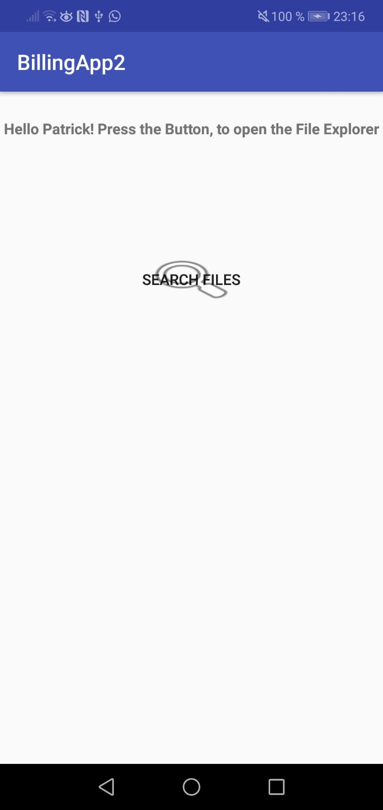
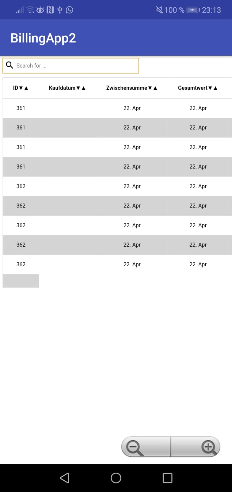
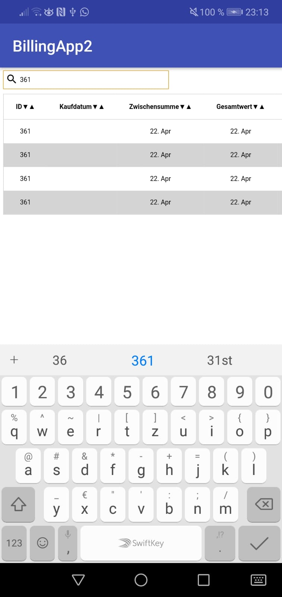

# AppWithWebview
A simple App, that can represent CSV data in an HTML table: Communication between Webapp and Android App <br>




<h4> The App Comunicates with the Webapp (\app\src\main\assets) over the JavaScript Interface </h4>

This are the important code Cells, followed by the Javascript Interface Class in CSV_Content.class
```        billing_table = (WebView) findViewById(R.id.table);
        WebSettings webSettings = billing_table.getSettings();
        webSettings.setJavaScriptEnabled(true);
        webSettings.setBuiltInZoomControls(true);
        billing_table.setWebChromeClient(new WebChromeClient());
        Log.i("Debug", "CSV DATA LENGTH in CSV CONTENT: " + csv_Data.length);
        billing_table.addJavascriptInterface(new JavaScriptInterface(csv_Data, this), "Android");
        billing_table.loadUrl("file:///android_asset/www/index.html");
```

Javascript Interface Class:
```

 public class JavaScriptInterface {
        Context mContext;
        String[][] csvData;

        public JavaScriptInterface(String[][] csv_data, Context context) {
            mContext = context;
            this.csvData = csv_data;
            Log.i("Debug", " JSInterface Class: " + csvData.length);
        }

        @JavascriptInterface
        public String getDataArrayAsString() {
            String result = "";
            for (int i = 0; i < csvData.length; i++) {

                for (int j = 0; j < csvData[i].length; j++) {
                    //result += "'";
                    result += csvData[i][j];
                    if (j == csvData[i].length - 1) {
                        //result += "'";
                    } else {
                        result += "^*";
                    }
                }
                result += "***";

            }
            System.out.println(result);
            return result;
        }

        @JavascriptInterface
        public String test() {
            return "Bridge working";
        }

    }
```

On the Webapplication site you then can call the methods from the Android app and get its variables: 
Example Function which uses Android method getDataArrayAsString()
```

function buildTable(order) {
  try {
    var old_table = document.getElementById('gemueseTable');
    old_table.parentNode.removeChild(old_table);
  } catch (err) {
    console.log("No table existing yet");
  }
  dataAsString = Android.getDataArrayAsString();
  console.log("DatenString from Android App: " + dataAsString);
  data  = dataAsString.split('***');
  data = data.map((value) => value.split('^*'))
  console.log("Debug");
  console.log(data1.length);
  console.log(data.length);
  var table = '<table id = "gemueseTable">';
  for (var i = 0; i < data.length; i++) {
    var row = data[i];
    if (i == 0) {
      table += '<thead>';
      table += '<tr>';
    } else {
      table += '<tr>';
    }

    for (var j = 0; j < row.length; j++) {
      if (i == 0) {
        if (order == '') {
          table += '<th id = "' + row[j] + ' "' + 'onclick=sort_2d_asc(data,' + j + ')>';
        } else if (order == 'asc') {
          table += '<th id = "' + row[j] + ' "' + 'onclick=sort_2d_desc(data,' + j + ')>';
        } else if (order == 'desc') {
          table += '<th id = "' + row[j] + ' "' + 'onclick=sort_2d_asc(data,' + j + ')>';
        }

        table += row[j];
        if (order == '') {
          table += "&#9660";
          table += "&#9650";
        } else if (order == 'asc') {
          table += "&#9650";
        } else if (order == 'desc') {
          table += "&#9660";
        }
        table += '</th>';
      } else {
        table += '<td contenteditable=true onBlur=saveChanges()>';
        table += row[j];
        table += '</td>';
      }
    }

    if (i == 0) {
      table += '</tr>';
      table += '</thead>';
      table += '<tbody>';
    } else {
      table += '</tr>';
    }
  }
  table += '</tbody>';
  table += '</table>';
  document.body.innerHTML += table;
}

```


